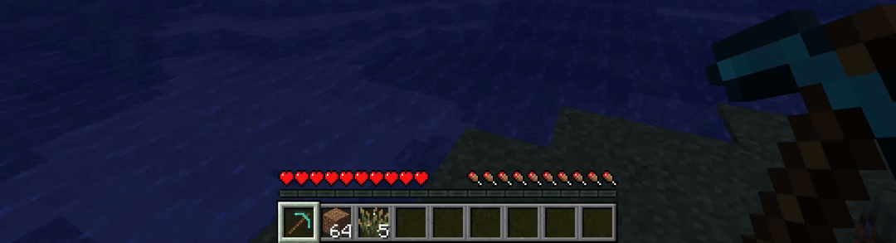

# FixItem

[](https://minecraft.net)
[](https://files.minecraftforge.net)
[](https://github.com/wsadqert/minecraft-FixItem/releases)
[](LICENSE)

A simple yet powerful Minecraft Forge mod that adds item repair and durability management commands to your server or singleplayer world.

## 📋 Features

### 🔧 Item Repair Commands

- **`/fix`** - Instantly repair the item in your main hand to full durability
- **`/setdurability <amount>`** - Set specific durability value for the held item
- **`/setdurabilitypercent <percent>`** - Set durability as a percentage (0-100%)

### ⚙️ Admin Controls

- **`/fixcommands allow`** - Enable fix commands (OP level 4 required)
- **`/fixcommands deny`** - Disable fix commands (OP level 4 required)
- Persistent configuration - settings are saved and loaded automatically

### 🛡️ Safety Features

- Commands only work on damageable items
- Permission-based access control (OP level 2 for repair commands)
- Automatic client synchronization to prevent visual glitches
- Error handling with user-friendly messages

## 🎮 Usage

### Basic Item Repair

Hold any damageable item (tools, weapons, armor) in your main hand and run:

```
/fix
```

*Requires OP level 2*

### Advanced Durability Control

Set exact durability values:

```
/setdurability 100
```

Set durability as percentage:

```
/setdurabilitypercent 75.5
```

### Server Administration

Enable/disable the mod's commands:

```
/fixcommands allow
/fixcommands deny
```

*Requires OP level 4*

## 📸 Demo Gallery

### Basic Item Repair

*Using `/fix` to instantly repair a damaged diamond pickaxe to full durability*

### Percentage-Based Durability Control

*Setting item durability to 10% using `/setdurabilitypercent 10`*

### Exact Durability Management

*Precisely controlling durability with `/setdurability` command*

### Admin Toggle System

*Server administrators can enable/disable fix commands with `/fixcommands allow|deny`*

## ⚡ Installation

1. **Download** the latest release from [GitHub Releases](https://github.com/wsadqert/minecraft-FixItem/releases)
2. **Install** Minecraft Forge 55.0.21 or compatible version
3. **Place** the `.jar` file in your `mods` folder
4. **Launch** Minecraft with the Forge profile

### Requirements

- **Minecraft**: 1.21.5
- **Forge**: 55.0.21+
- **Server-only**

## 🔧 Configuration

The mod automatically creates a configuration file at `config/fix_commands.json`:

```json
{
  "enabled": true
}
```

- `enabled`: Controls whether fix commands are available to players
- Configuration persists across server restarts
- Can be modified via in-game commands or by editing the file directly

## 🎯 Permissions

| Command | Permission Level | Description |
|---------|-----------------|-------------|
| `/fix` | OP Level 2 | Repair items |
| `/setdurability` | OP Level 2 | Set exact durability |
| `/setdurabilitypercent` | OP Level 2 | Set percentage durability |
| `/fixcommands` | OP Level 4 | Toggle command availability |

## 🐛 Known Issues

- Items must be in the main hand (off-hand not supported)
- Only works with vanilla damageable items
- Custom durability mechanics from other mods may not be compatible

## 🤝 Contributing

Contributions are welcome! Please feel free to submit issues, feature requests, or pull requests on [GitHub](https://github.com/wsadqert/minecraft-FixItem).

### Building from Source

```bash
git clone https://github.com/wsadqert/minecraft-FixItem.git
cd FixItem
./gradlew build
```

## 📄 License

All Rights Reserved - See [LICENSE](LICENSE) file for details.

## 📞 Support

- **Issues**: [GitHub Issues](https://github.com/wsadqert/minecraft-FixItem/issues)
- **Discussions**: [GitHub Discussions](https://github.com/wsadqert/minecraft-FixItem/discussions)

## 🔗 Links

- **GitHub Repository**: [https://github.com/wsadqert/minecraft-FixItem](https://github.com/wsadqert/minecraft-FixItem)
- **CurseForge**: *[Add CurseForge link when published]*
- **Modrinth**: *[Add Modrinth link if applicable]*

---

**Made with ❤️ by wsadqert**

*If you enjoy this mod, consider giving it a ⭐ on GitHub!*
